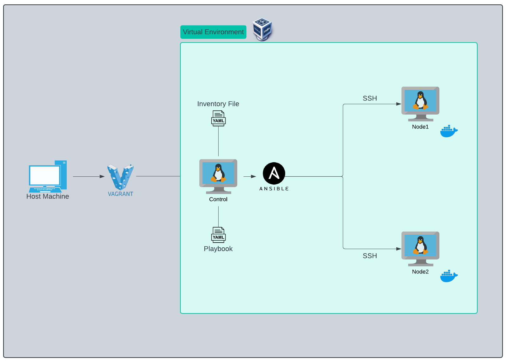

# My Projects Repository

Greetings! This repo hosts all my projects :)

## Projects
Explore my projects [here](https://jglsung.github.io/)!

### Building Lab Environment

This project demonstrates how to set up a virtual lab environment using Vagrant, VirtualBox, and Ansible to automate the installation of Docker and Docker Compose.

## Contact
For any inquiries, you can reach me at:
- LinkedIn: [@jglsung](https://www.linkedin.com/in/jglsung/)
- Github: [@jglsung](https://github.com/jglsung/)

